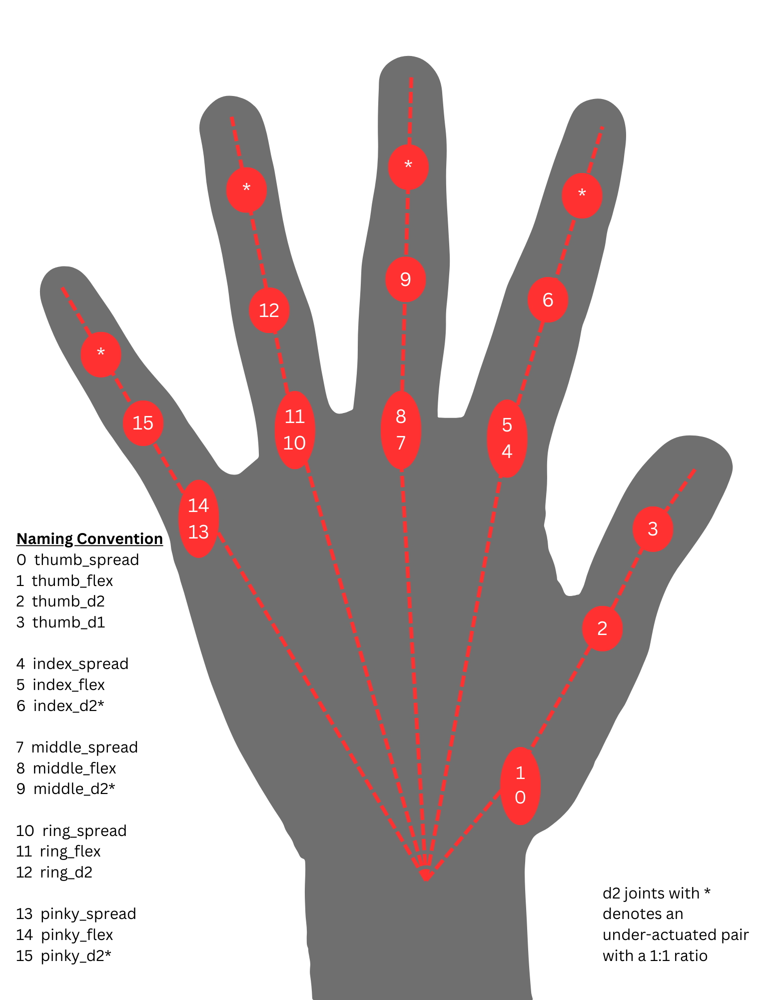

# [Artus Lite](/ArtusAPI/robot/artus_lite/data/Artus%20Lite%20Quick%20Start.pdf)

see [data>Artus Lite Quick Start PDF](/ArtusAPI/robot/artus_lite/data/Artus%20Lite%20Quick%20Start.pdf).

see [data>Artus Lite Technical Specification PDF](/ArtusAPI/robot/artus_lite/data/).

## Power Requirement

The Artus Lite should be connected to a 24 VDC power supply, requiring a maximum instantaneous draw of 200W, minimum 48W and typical 100W.

## Communication Methods

Hands are shipped at default with USB communication enabled unless otherwise specified.

## Hand Joint Map
Below is a Joint index guide mapped to a normal human hand with the naming convention and joint indices of the hand for control purposes.

__A note about Joint Limits__

* D2, D1 and Flex joints have a range of [0,90]
* Spread joints are normally [-15,15] with the thumb being the exception [-30,30]
* For spreading, the positive spread value will be towards the right hand thumb, negative spread value is towards the pinky

