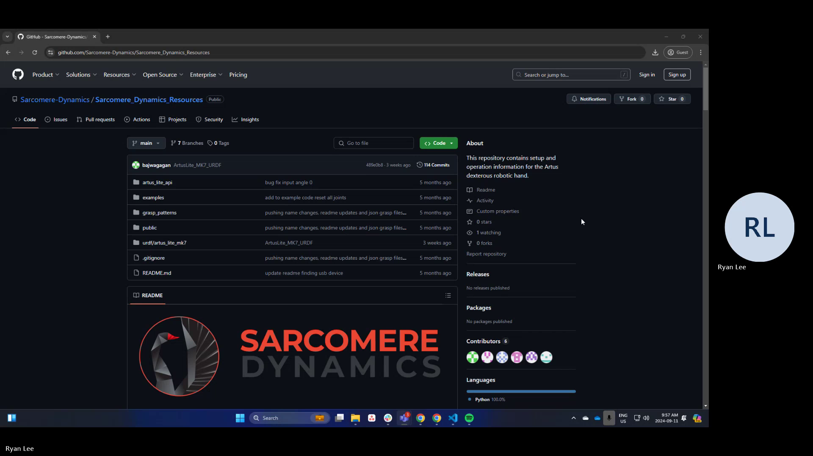

# Python Artus Robotic Hand API
This repository contains a Python API for controlling the Artus robotic hands by Sarcomere Dynamics Inc.

Please contact the team if there are any issues that arise through the use of the API.

## Table of Contents
* [Getting Started](#getting-started)
    * [Video Introduction](#video-introduction)
    * [Requirements](#requirements)
    * [USB Driver](#usb-driver)
    * [Installation](#installation)
* [Usage](#usage)
    * [Running example.py](#running-examplepy)
    * [Creating an ArtusAPI Class Object](#creating-an-artusapi-class-object)
    * [Serial Example](#serial-example)
    * [Normal Startup Procedure](#normal-startup-procedure)
* [Interacting with the API](#interacting-with-the-api)
    * [Setting Joints](#setting-joints)
    * [Getting Feedback](#getting-feedback)
* [Directory Structure](#directory-structure)

## Getting Started
### Video Introduction
[](https://www.youtube.com/watch?v=30BkuA0EkP4)

### Requirements
Requires Python version >= 3.10 installed on the host system. Please visit the [Python website](https://www.python.org/downloads/) to install Python.

#### USB Driver
If the host system cannot find the Artus Lite as a USB device once it is connected over USBC, go to [FTDI Driver Download](https://ftdichip.com/drivers/vcp-drivers/) to install the virtual COM port driver (usually only required for Windows). 

### Installation
Using pip:
```bash
pip install psutil
pip install pyserial
pip install ArtusAPI
```

## Usage

### Running example.py
Before running the example script, determine whether your Artus Lite is running USB Serial or WiFi, and edit the following line with the name of the port over UART or target SSID for WiFi

* On Windows, find the port name by navigating to "Device Manager">"Ports". It should show up as a COM port. (e.g. COM3)
* On Linux, use the command `dmesg | grep ttyUSB` to find the usb device. (e.g. /dev/ttyUSB1)
    * If a permission error is encountered, use the command `sudo chmod 777 /dev/ttyUSB1` 

```python
artusapi = ArtusAPI(communication_method='UART',hand_type='right',communication_channel_identifier='/dev/ttyUSB1')
```

### Creating an ArtusAPI Class Object
Below are some examples of instantiating the ArtusAPI class to control a single hand. Below is a description of the parameters and what they mean.

* `__communication_method__` : The communication method between the host system and the Artus hand
* `__communication_channel_identifier__` : The identifying parameter of the communication method such as COM port over Serial or network name over WiFi
* `__robot_type__` : The Artus robot hand name 
* `__hand_type__` : left or right hand
* `__stream__` : whether streaming feedback data is required or not. Default: `False`
* `__communication_frequency__` : The frequency of the feedback and command communication. Default: `400` Hz
* `__logger__` : If integrating the API into control code, you may already have a logger. THis will allow for homogeneous logging to the same files as what you currently have. Default: `None`
* `__reset_on_start__` : If the hand is not in a closed state when last powered off, setting to `1` will open the hand before ready to receive commands. This _MUST_ be set if powered off in a closed state, or a calibrate must be run before sending target commands
* `__baudrate__` : required to differentiate between Serial over USB-C and Serial over RS485, default `921600` for SUBC, `115200` for RS485

#### Serial Example
```python
from ArtusAPI.artus_api import ArtusAPI
artus_lite = ArtusAPI(robot_type='artus_lite', communication_type='UART',hand_type='right',communication_channel_identifier='COM7')

artus_lite.connect()
```

### Normal Startup Procedure
There is a standard series of commands that need to be followed before sending target commands or receiving feedback data is possible. 

Before any software, ensure that the power connector is secured and connected to the Artus hand and if using a wired connection (Serial or CANbus), ensure the connection/cable is good. 

First, to create a communication connection between the API and the Artus hand, `ArtusAPI.connect()` must be run to confirm communication is open on the selected communication type.

Second, the `ArtusAPI.wake_up()` function must be run to allow the hand to load it's necessary configurations.

Once these two steps are complete, optionally, you can run `ArtusAPI.calibrate()` to calibrate the finger joints. Otherwise, the system is now ready to start sending and receiving data!

## Interacting with the API
To get the most out of the Artus hands, the functions that will likely be most interacted with are `set_joint_angles(self, joint_angles:dict)` and `get_joint_angles(self)`. The `set_joint_angles` function allows the user to set 16 independent joint values with a desired velocity/force value in the form of a dictionary. See the [grasp_close file](data/hand_poses/grasp_close.json) for an example of a full 16 joint dictionary for the Artus Lite. See the [Artus Lite README](ArtusAPI/robot/artus_lite/README.md) for joint mapping.

### Setting Joints
As mentioned above, there are 16 independent degrees of freedom for the Artus Lite, which can be set simultaneously or independently. If, for example, a user need only curl the pinky, a shorter dictionary like the following could be used as a parameter to the function:
```
pinky_dict = {"pinky_flex" : 
                            {
                                "index": 14,
                                "input_angle" : 90
                            },
              "pinky_d2" :
                            {
                                "index":15,
                                "input_angle" : 90
                            }
            }

ArtusAPI.set_joint_angles(pinky_dict)
```

Notice that the above example does not include the `"input_speed"` field that the json file has. The `"input_speed"` field is optional and will default to the nominal speed.

### Getting Feedback
There are two ways to get feedback data depending on how the class is instantiated.

1. In streaming mode (`stream = True`), after sending the `wake_up()` command, the system will start streaming feedback data which will populate the `ArtusAPI._robot_handler.robot.hand_joints` dictionary. Fields that hold feedback data are named with `feedback_X` where _X_ could be angle, current or temperature.
2. In Request mode (`stream = False`), sending a `get_joint_angles()` command will request the feedback data before anything is sent from the Artus hand. This communication setting is slower than the streaming mode, but for testing purposes and getting familiar with the Artus hand, we recommend starting with this setting. 


## Directory Structure
```bash
├── ArtusAPI
│   ├── commnands
│   │   ├── commands.py # Command strings for the Robot Hand
│   ├── communication
│   │   ├── WiFi
│   │   │   ├── WiFi.py # WiFi communication class
│   │   ├── UART
│   │   │   ├── UART.py # UART communication class
│   │   ├── communication.py # Communication class for the API
│   ├── robot
│   │   ├── artus_lite
│   │   │   ├── artus_lite.py # Artus Lite Hand class
│   │   ├── robot.py # Robot Hand class for the API
│   ├── artus_api.py # API Core

## Video Intro

[](https://sarcomere-my.sharepoint.com/:v:/g/personal/ryan_lee_sarcomeredynamics_com/EY_UR4HaeHpEpnJB4n_dzHsBXcxdkdTEQWbrUFWpzqpXPw)

Video is available [here](./public/Artus_Lite_API_Getting_Started.mp4)

## Table of Contents
* [Requirements & Install](#requirements--install)
    * [USB Driver](#usb-driver)
* [API Core](#api-core)
    * [Parameters](#parameters)
    * [Class Methods](#class-methods)
* [Joint Class](#joint-class)
    * [Parameters](#parameters-1)
    * [Class Variables](#class-variables)
    * [Class Methods](#class-methods-1)
    * [A note about joint limits](#a-note-about-joint-limits)
* [Running example.py](#running-examplepy)
    * [Control Flow](#control-flow)
    * [Editing the Grasp Files](#editing-grasp-text-files)
* [Implementation Examples](#implementation-examples)
    * [Setting input values](#setting-input-values)
    * [Getting feedback values](#getting-feedback-values)
    * [Controlling multiple hands](#controlling-multiple-hands)
* [Teleoperation Considerations](#teleoperation-considerations)
* [Firmware Updates](#firmware-updates)
* [Revisions](#revisions)

## Requirements & Install
The API is a python based API developed and tested on `Python >= 3.10` please visit the [Python website](https://www.python.org/downloads/) to install Python.

To install the pip libraries, please run the following commands:\
`cd artus_lite_api`\
`pip install -r requirements.txt`

### USB Driver
If the host system cannot find the Artus Lite as a USB device once it is connected over USBC, go to [FTDI Driver Download](https://ftdichip.com/drivers/vcp-drivers/) to install the virtual COM port driver. 

## API Core
```python
class ArtusAPI()
```

### Parameters:
- **communication_method**: UART or WiFi.
- **port**: COM port for UART
- **target_ssid**: default will be set when shipped but replace with whatever your Artus Lite hand WiFi network name is. Only necessary for WiFi

Note that there should only be one single machine running one instance of the API to control 1-2 hands.

### Class Methods:
- **`start_connection`**: start the connection to the Artus Lite over WiFi or UART as specified
- **`start_robot`**: send a start command to the Artus Lite over WiFi or UART as specified
- **`close_connection`**: close the connection to the Artus Lite over WiFi or UART as specified
- **`send_target_command`**: sends a targetting command based on the `input` data fields in the joint dictionary
- **`get_robot_states`**: send a message to the Artus Lite to receive joint data and populates `feedback` data fields in joints
- **`calibrate`**: send a calibrate command to the Artus Lite over WiFi or UART as specified
- **`sleep`**: send a sleep command to the Artus Lite over WiFi or UART as specified that saves the current positions of the hand to non-volatile memory in preparation for power cycling
- **`save_grasp_pattern`**: save a grasp pattern in robot_command to a text file in grasp_patterns folder
- **`get_grasp_pattern`**: get a grasp patptern from a text file in grasp_patterns folder

## Joint Class
```python
class ArtusLiteJoint()
```
### Parameters:
- **`joint_name`**: name of the joint
- **`maximum_angle_constraint` and `minimum_angle_constraint`**: angle constraints
- **`maximum_speed_constraint` and `minimum_speed_constraint`**: speed constraints

### Class Variables:
- **`input_speed`**: input speed for next target
- **`input_angle`**: input angle for next target
- **`feedback_angle`**: reported angle
- **`feedback_temperature`**: reported temperature of actuator associated with the joint
- **`feedback_current`**: reported current of actuator associated with joint

### Class Methods:
- **`check_input_constraints`**: called automatically in `send_target_command`, this ensures that values written to the Artus Lite are in the format expected


### A note about joint limits:
* All D2, D1 and flex joints have a range of 0-90 degrees
* Thumb spread is between -30 and 30, while the rest of the spreads are -15 to 15. 

## Running example.py
Before running the example script, determine whether your Artus Lite is running WiFi or UART, and edit the following line with the name of the target SSID for WiFi and port over UART

* On Windows, find the port name by navigating to "Device Manager">"Ports". It should show up as a COM port. (e.g. COM3)
* On Linux, use the command `dmesg | grep ttyUSB` to find the usb device. (e.g. /dev/ttyUSB1)
    * If a permission error is encountered, use the command `sudo chmod 777 /dev/ttyUSB1` 

```python
artus_lite = ArtusAPI(target_ssid='Artus3DLH',port='/dev/ttyUSB0',communication_method='Wifi')
```
When running the example script, the following menu will be shown within the terminal:
```
Artus Lite API v1.1.0
Command options:
1. start connection to hand
2. start robot
3. calibrate
4. send command from grasp_patterns/example_command.txt
5. get states
6. open hand from grasp_patterns/grasp_open.txt
7. close hand using grasp in grasp_patterns/grasp.txt
8. save current hand state for power cycle
9. close connection


r : reset joint
Fun Hand Signs:
s : Spock
p : Peace
d : Devil Ears
o : Number One
l : pinch
Enter command: 
```
### Control Flow
The first thing to do is to start the connection to the hand by pressing "1". 

Next, you want to send the start robot command "2". 

Next to send a command, you can edit the `example_command.txt` file in the grasp_patterns folder. 

### Editing Grasp text files
*Note when editing the grasps files:*\
`c176p[+00,+00,+00,+00,+00,+00,+00,+00,+00,+00,+00,+00,+00,+00,+00,+00]v[+90,+90,+90,+90,+90,+90,+90,+90,+90,+90,+90,+90,+90,+90,+90,+90]end`

The first array[] of 16 elements is the input angle in degrees mapped to the joints as shown in the hand joint map, and the second array[] of 16 elements is the input speed in percentage mapped to the joints as shown in the hand joint map.

e.g. to set the `thumb_flex` to 45 degrees which is associated with index 0, you would change the first element in the first array so that the new command would be:\
`c176p[+45,+00,+00,+00,+00,+00,+00,+00,+00,+00,+00,+00,+00,+00,+00,+00]v[+90,+90,+90,+90,+90,+90,+90,+90,+90,+90,+90,+90,+90,+90,+90,+90]end`

To edit the command there are a few things that need to be accounted for:
* each element in the array has 3 characters and must follow this convention
    * examples of allowable angles `+06` or `+90` or `-10` as these are all 3 characters long
    * velocities are in percentage, and should range from `+75` to `100` - note `100` does not have a +/- in front of it as it is already 3 characters in length
    * if this command convention is not followed, the hand may act unpredictably

## Implementation Examples
Below are some examples of how you can implement these functions in your code that are not covered by the `example.py` script.\
### Setting input values:
*Name accessible :*
```python
artus_lite.joints['thumb_flex'].input_angle = 45
```
*Through a Loop :*\
In this example, the assumption is you have an array of angles that are already mapped to the indices of the Artus Lite
```python
# input angles come from your control code, have 16 elements of type int or float and are mapped to our hand joint map
input_angles_from_control = []

for joint,joint_info in artus_lite.joints.items():
    joint_info.input_angle = input_angles_from_control[joint_info.index]
```

### Getting feedback values:
In the same way as setting input values, we can access feedback data after calling `artus_lite.get_robot_states()` by name.\
*Name accessible :*
```python
artus_lite.joints['thumb_flex'].feedback_angle
```

### Controlling multiple hands:
We can define two instances of hands with different `port` and `target_ssid`. In theory, it can spin up an unlimited amount of hands, bottlenecked by the amount of wifi controllers and COM ports associated with the machine. e.g.
```python
artus_liteLeft = Artus3DAPI(target_ssid='Artus3DLH',port='/dev/ttyUSB0',communication_method='UART')
artus_liteRight = Artus3DAPI(target_ssid='Artus3DRH',port='/dev/ttyUSB1',communication_method='UART')
artusHands = [artus_liteLeft,artus_liteRight]
``` 

## Teleoperation Considerations
** **IT IS IMPORTANT TO ADD A DELAY BETWEEN SENDING MESSAGES, CURRENT SUGGESTED FREQUENCY FOR BEST USE IS 10 Hz OR DELAY OF 0.1s** **

## Directory Structure
```bash
artus_lite_api
├── ArtusAPI.py # Python API for Artus Lite
├── src # Dependencies for the API
│   ├── python_server.py # for WiFi communication
│   ├── python_uart.py # for UART communication
|   └── Artus3DJoint.py # our Joint class
├── requirements.txt # for easy pip install
grasp_patterns
├── grasp_patterns # grasps folder
examples
├── example.py # for easy pip install
public
README.md
```

## Revision Control
| Date  | Revision | Description | 
| :---: | :------: | :---------: |
| Nov. 14, 2023 | v1.0 | Initial release - Artus Lite Mk 5 |
| Apr. 23, 2024 | v1.1 | Beta release - Artus Lite Mk 6 |
